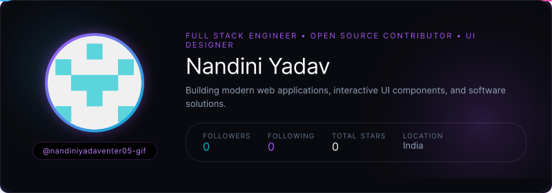
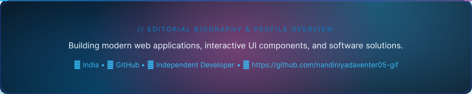
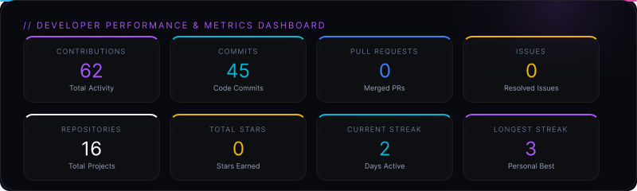
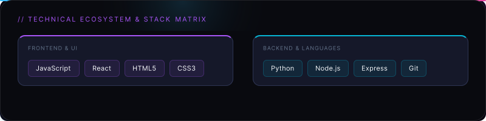

  

---

  

---

  

---

### // CURRENT PROJECT

**[nandiniyadaventer05-gif](https://github.com/nandiniyadaventer05-gif/nandiniyadaventer05-gif)**

  ⭐ <b>0</b> Stars &nbsp;•&nbsp; 🍴 <b>0</b> Forks &nbsp;•&nbsp; 📜 <b>MIT</b> License

---

### // FEATURED PORTFOLIO

<table width="100%">
  <tr>
    <td width="50%" align="left" valign="top">
      <a href="https://github.com/nandiniyadaventer05-gif/nandiniyadaventer05-gif"><b>nandiniyadaventer05-gif</b></a>
        
      ⭐ <b>0</b> &nbsp;•&nbsp; <a href="https://github.com/nandiniyadaventer05-gif/nandiniyadaventer05-gif">View Repository →</a>
    </td>
    <td width="50%" align="left" valign="top">
      <a href="https://github.com/nandiniyadaventer05-gif/OJT-PROJECT"><b>OJT-PROJECT</b></a>
        
      <code>JavaScript</code> &nbsp;•&nbsp; ⭐ <b>0</b> &nbsp;•&nbsp; <a href="https://github.com/nandiniyadaventer05-gif/OJT-PROJECT">View Repository →</a>
    </td>
  </tr>
</table>

---

  

---

### // LIVE PREVIEW

<i>High-fidelity components generated by Profile Aura</i>

#### Hero Preview

#### Overview Preview

#### Metrics Preview

---

### 🤝 Connect & Social Links

  

---

  Designed with <a href="https://github.com/kalashmishra21/profile-aura">Profile Aura 2.0</a>

